# 基于机器学习的软件缺陷预测 —— 实验报告

---

**项目地址**：[GitHub - NIGuangYuan/software-defect-prediction](https://github.com/NIGuangYuan/software-defect-prediction)

---

## 摘要

软件缺陷预测是软件质量保障领域的关键技术之一。本项目基于 NASA MDP（Metrics Data Program）数据集，构建了一套完整的机器学习缺陷预测流水线，涵盖数据加载、预处理、模型训练、评估与可解释性分析全流程。项目在 JM1、KC1、PC1 三个真实软件项目数据集上，对比了逻辑回归（LR）、支持向量机（SVM）、随机森林（RF）和 XGBoost 四种模型的预测性能，并通过 SMOTE 过采样技术缓解类别不平衡问题。实验结果表明，集成学习方法（随机森林、XGBoost）在 Accuracy 和 ROC-AUC 指标上整体表现更优，而线性模型在 Precision-Recall 平衡方面具有一定优势。此外，通过 SHAP 可解释性分析揭示了关键软件度量指标对缺陷预测的贡献。

**关键词**：软件缺陷预测；机器学习；NASA MDP；SMOTE；SHAP；模型评估

---

## 1. 项目背景与意义

### 1.1 研究背景

随着软件系统规模和复杂度的持续增长，软件质量保障面临巨大挑战。软件缺陷（Software Defect）不仅会导致系统故障和经济损失，在安全关键系统中甚至可能危及人身安全。传统的软件测试和代码审查方法虽然有效，但资源消耗巨大且难以覆盖所有模块。

软件缺陷预测（Software Defect Prediction, SDP）旨在利用历史数据和软件度量指标，在测试资源有限的情况下，提前识别出最可能存在缺陷的软件模块，从而实现测试资源的合理分配。

### 1.2 研究意义

- **提高测试效率**：将有限的测试资源集中在高风险模块上
- **降低维护成本**：早期发现和修复缺陷可显著降低后期修复成本
- **辅助决策**：为项目管理者提供数据驱动的质量评估依据
- **可解释性**：通过特征重要性分析，帮助开发者理解哪些代码特征与缺陷高度相关

### 1.3 项目目标

1. 构建可复现的软件缺陷预测实验流水线
2. 在多个 NASA MDP 数据集上对比不同 ML 模型的预测性能
3. 分析类别不平衡对预测结果的影响及 SMOTE 的改善效果
4. 基于 SHAP 值进行模型可解释性分析
5. 通过丰富的可视化图表直观展示实验结果

---

## 2. 数据集介绍

### 2.1 NASA MDP 数据集

本项目使用 PROMISE 软件工程仓库中的 NASA MDP 数据集。该数据集收集自 NASA 的真实软件项目，是软件缺陷预测领域最广泛使用的基准数据集之一。

| 数据集 | 编程语言 | 项目描述 | 样本数 | 特征数 | 缺陷率 |
|--------|----------|----------|--------|--------|--------|
| **JM1** | C | 实时预测地面系统 | 8,908 | 21 | 22.50% |
| **KC1** | C++ | 地面数据存储管理系统 | 1,212 | 21 | 25.99% |
| **PC1** | C | 地球轨道卫星飞行软件 | 954 | 21 | 7.34% |

### 2.2 数据集概览

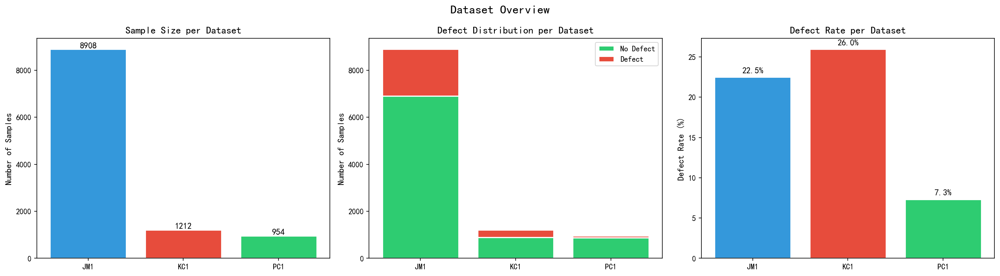

*图1：三个数据集的基本统计信息对比。从左至右分别为样本量、缺陷分布和缺陷率。*

从上图可以看出：
- **JM1** 样本量最大（8,908条），适合训练复杂的集成模型
- **KC1** 为中等规模数据集（1,212条），缺陷率最高（25.99%）
- **PC1** 样本量最小（954条），且缺陷率极低（7.34%），是一个典型的极度不平衡数据集

### 2.3 特征说明

每个数据样本包含 21 个软件度量特征，主要涵盖三大类：

| 类别 | 特征 | 说明 |
|------|------|------|
| **McCabe度量** | cyclomatic_complexity, essential_complexity, design_complexity 等 | 衡量代码的控制流复杂度 |
| **Halstead度量** | volume, length, difficulty, effort, error_est 等 | 基于操作符和操作数计数的代码度量 |
| **代码规模度量** | loc_total, loc_blank, loc_code_and_comment, branch_count 等 | 代码行数、分支数等规模指标 |

### 2.4 类别分布

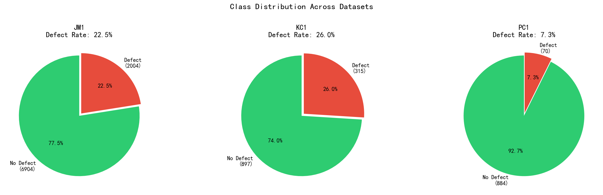

*图2：各数据集的缺陷类别分布饼图。绿色为无缺陷样本，红色为有缺陷样本。*

三个数据集均呈现不同程度的类别不平衡问题。其中 PC1 的不平衡最为严重，缺陷样本仅占 7.34%，这对分类器的学习能力提出了较高要求。

---

## 3. 研究方法

### 3.1 整体技术路线

本项目实现了一条完整的机器学习流水线，主要包含以下阶段：

```
数据加载 → 数据清洗 → 特征工程 → 标准化 → SMOTE过采样
    → 模型训练 → 模型评估 → 可视化 → SHAP可解释性分析
```

### 3.2 数据预处理

#### 3.2.1 数据清洗

- **去重处理**：移除重复记录（JM1移除4,296条，KC1移除897条，PC1移除155条）
- **缺失值处理**：使用中位数填充缺失值
- **数据类型统一**：确保所有特征列为数值类型，标签列二值化（0=无缺陷，1=有缺陷）

> **注**：NASA MDP 数据集已知存在数据质量问题（Shepperd et al. 2013），重复记录是其中的主要问题。本项目参考了相关文献，进行了适当的去重处理。

#### 3.2.2 特征工程

1. **低方差特征过滤**：移除方差低于阈值（0.01）的特征，减少噪声
2. **高相关性特征过滤**：移除相关系数超过 0.95 的冗余特征，降低多重共线性
3. **特征标准化**：使用 `StandardScaler` 将特征缩放至均值为0、方差为1的标准正态分布

#### 3.2.3 类别不平衡处理：SMOTE

针对数据集中缺陷样本远少于正常样本的问题，采用 **SMOTE（Synthetic Minority Oversampling Technique）** 对训练集中的少数类（缺陷样本）进行过采样。SMOTE 通过在特征空间中少数类样本之间进行线性插值来合成新样本，相比简单的随机过采样，能有效降低过拟合风险。

### 3.3 机器学习模型

| 模型 | 类型 | 特点 | 关键参数 |
|------|------|------|----------|
| **Logistic Regression** | 线性模型（基线） | 简单、可解释性强 | C=1.0, class_weight='balanced' |
| **SVM (RBF Kernel)** | 非线性分类器 | 适合高维数据 | kernel='rbf', probability=True |
| **Random Forest** | 集成学习（Bagging） | 抗过拟合、特征重要性 | n_estimators=100, max_depth=10 |
| **XGBoost** | 集成学习（Boosting） | 高性能、正则化 | n_estimators=100, max_depth=6, lr=0.1 |

所有模型均使用 `class_weight='balanced'` 参数以缓解类别不平衡，并设置 `random_state=42` 保证可复现性。

### 3.4 评估指标

考虑到缺陷预测任务中类别不平衡的特点，本项目采用多维度评估指标体系：

| 指标 | 公式/说明 | 适用场景 |
|------|-----------|----------|
| **Accuracy** | (TP+TN)/(TP+TN+FP+FN) | 整体正确率，在不平衡数据中可能虚高 |
| **Precision** | TP/(TP+FP) | 预测为缺陷中真正有缺陷的比例 |
| **Recall** | TP/(TP+FN) | 实际缺陷中被正确识别的比例 |
| **F1-Score** | 2×P×R/(P+R) | Precision和Recall的调和平均 |
| **MCC** | 马修斯相关系数 | 适合不平衡数据的综合指标 |
| **ROC-AUC** | ROC曲线下面积 | 衡量模型的排序能力 |
| **混淆矩阵** | TP/FP/FN/TN | 直观展示分类结果的分布 |

### 3.5 实验配置

- **训练/测试划分**：70% 训练集，30% 测试集（stratified split）
- **随机种子**：42（确保可复现性）
- **SMOTE**：默认启用，仅应用于训练集
- **超参数**：使用默认参数（可通过 `--tune` 启用 GridSearchCV 调优）

---

## 4. 实验结果与分析

### 4.1 特征相关性分析

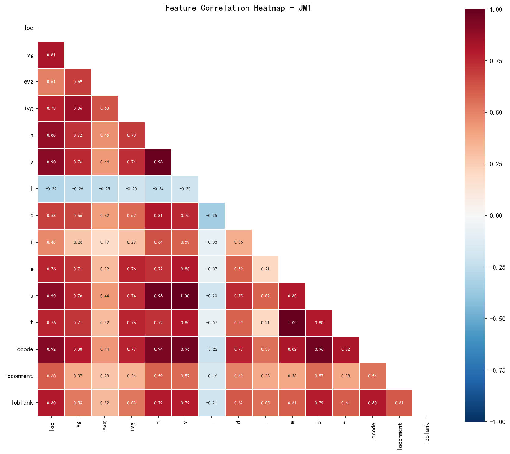

*图3：JM1 数据集特征相关性热力图（前15个特征）。红色表示正相关，蓝色表示负相关。*

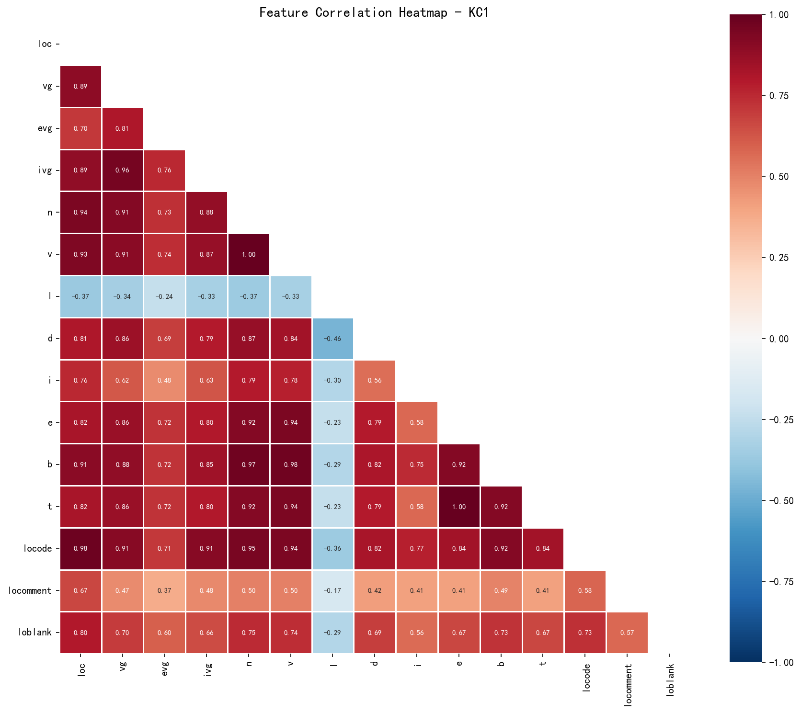

*图4：KC1 数据集特征相关性热力图。*

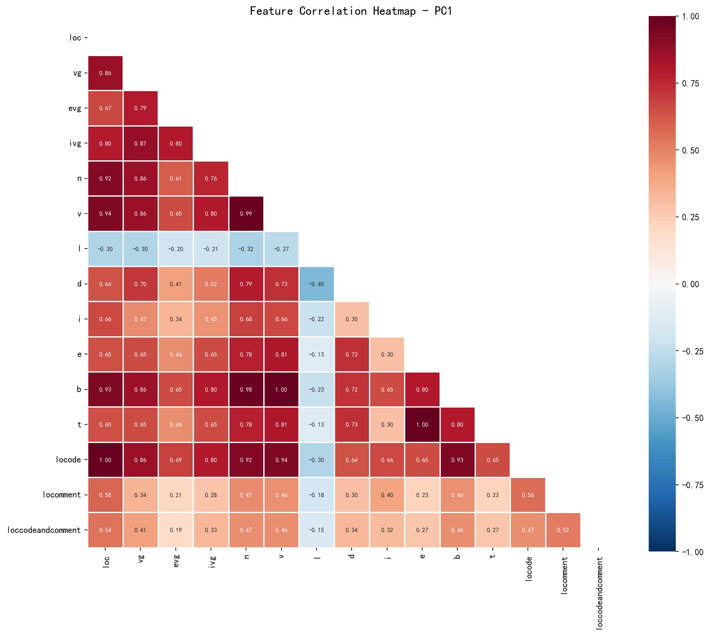

*图5：PC1 数据集特征相关性热力图。*

从相关性热力图可以看出：
- **Halstead 度量族**（如 volume、length、effort 等）之间普遍存在高度正相关（r > 0.9），说明这些度量反映了相似的代码特性
- **McCabe 度量**（如 cyclomatic_complexity、essential_complexity）与 Halstead 度量之间的相关性相对较低，提供了互补的代码信息
- 高相关性的特征对在预处理阶段被识别并移除，有效降低了特征维度和多重共线性

### 4.2 模型性能对比

#### 4.2.1 JM1 数据集

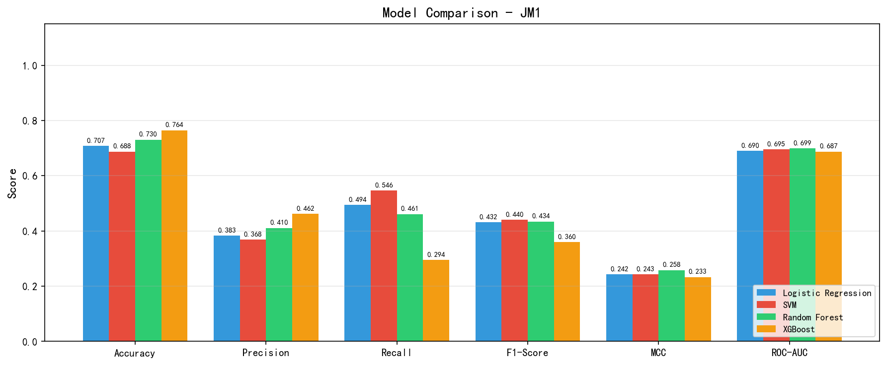

*图6：JM1 数据集上四类模型的多指标对比。*

**JM1 评估结果表：**

| 模型 | Accuracy | Precision | Recall | F1-Score | MCC | ROC-AUC |
|------|----------|-----------|--------|----------|-----|---------|
| Logistic Regression | 0.7074 | 0.3832 | 0.4942 | 0.4317 | 0.2424 | 0.6897 |
| SVM | 0.6876 | 0.3685 | 0.5458 | 0.4400 | 0.2432 | 0.6952 |
| Random Forest | 0.7299 | 0.4104 | 0.4609 | 0.4342 | 0.2583 | 0.6993 |
| XGBoost | 0.7643 | 0.4621 | 0.2945 | 0.3598 | 0.2325 | 0.6869 |

**分析：** 在 JM1 数据集上，XGBoost 取得了最高的 Accuracy（0.7643）和 Precision（0.4621），但 Recall 偏低（0.2945）。SVM 在 Recall 方面表现最佳（0.5458），更善于发现缺陷。整体而言，JM1（大规模数据集）上各模型在 F1-Score 上差异不大，但 Precision-Recall 的权衡策略有所不同。

#### 4.2.2 KC1 数据集

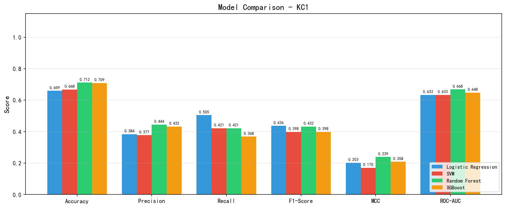

*图7：KC1 数据集上四类模型的多指标对比。*

**KC1 评估结果表：**

| 模型 | Accuracy | Precision | Recall | F1-Score | MCC | ROC-AUC |
|------|----------|-----------|--------|----------|-----|---------|
| Logistic Regression | 0.6593 | 0.3840 | 0.5053 | 0.4364 | 0.2026 | 0.6334 |
| SVM | 0.6676 | 0.3774 | 0.4211 | 0.3980 | 0.1698 | 0.6330 |
| Random Forest | 0.7115 | 0.4444 | 0.4211 | 0.4324 | 0.2394 | 0.6680 |
| XGBoost | 0.7088 | 0.4321 | 0.3684 | 0.3977 | 0.2084 | 0.6481 |

**分析：** 在 KC1（中等规模数据集）上，Logistic Regression 的 Recall 最高（0.5053），随机森林的 Precision 和 MCC 最高。值得注意的是，该数据集的整体 AUC 值偏低（0.63-0.67），说明中等规模下的特征区分度有限。

#### 4.2.3 PC1 数据集

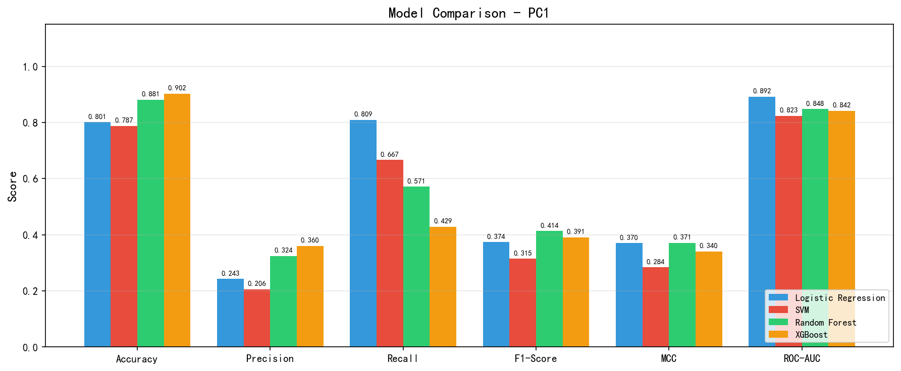

*图8：PC1 数据集上四类模型的多指标对比。*

**PC1 评估结果表：**

| 模型 | Accuracy | Precision | Recall | F1-Score | MCC | ROC-AUC |
|------|----------|-----------|--------|----------|-----|---------|
| Logistic Regression | 0.8014 | 0.2429 | 0.8095 | 0.3736 | 0.3701 | 0.8919 |
| SVM | 0.7875 | 0.2059 | 0.6667 | 0.3146 | 0.2840 | 0.8233 |
| Random Forest | 0.8815 | 0.3243 | 0.5714 | 0.4138 | 0.3710 | 0.8476 |
| XGBoost | 0.9024 | 0.3600 | 0.4286 | 0.3913 | 0.3402 | 0.8416 |

**分析：** PC1 是最具挑战性的数据集（缺陷率仅 7.34%）。Logistic Regression 表现出惊人的 Recall（0.8095），几乎识别出了 81% 的缺陷，且 AUC（0.8919）在四个模型中最高，表明线性模型在极度不平衡的小数据集上可能具有更好的泛化能力。XGBoost 的 Accuracy 最高（0.9024），但这主要受益于大量正确分类的负类样本。

### 4.3 混淆矩阵分析

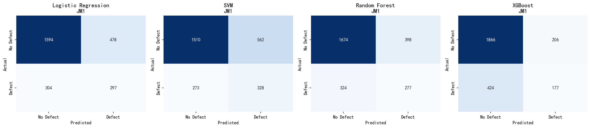

*图9：JM1 数据集上各模型的混淆矩阵。*

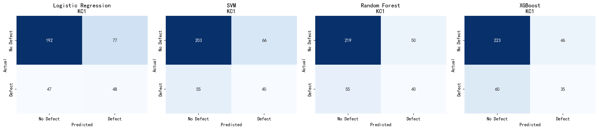

*图10：KC1 数据集上各模型的混淆矩阵。*

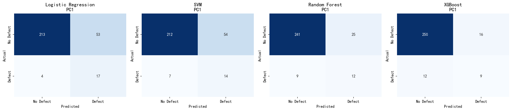

*图11：PC1 数据集上各模型的混淆矩阵。*

从混淆矩阵可以看出：
- **SVM 和 Logistic Regression** 倾向于产生更多的 True Positive（正确识别缺陷），但代价是更多的 False Positive（误报）
- **XGBoost** 在三个数据集上均表现保守，False Positive 较少但 False Negative 较多（漏报率高）
- 在工业实践中，根据应用场景的不同，需要在 Precision 和 Recall 之间做出权衡：安全关键系统优先保证高 Recall（不漏报），而资源有限的项目可能更看重 Precision（减少误报带来的审查成本）

### 4.4 ROC曲线分析

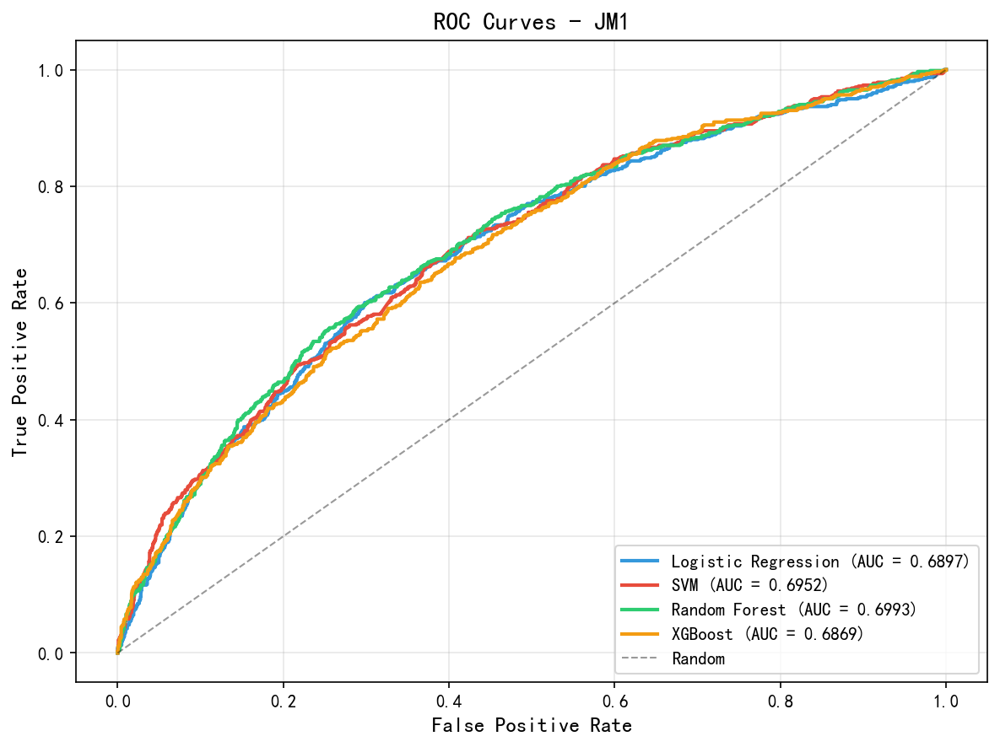

*图12：JM1 数据集上各模型的 ROC 曲线。*

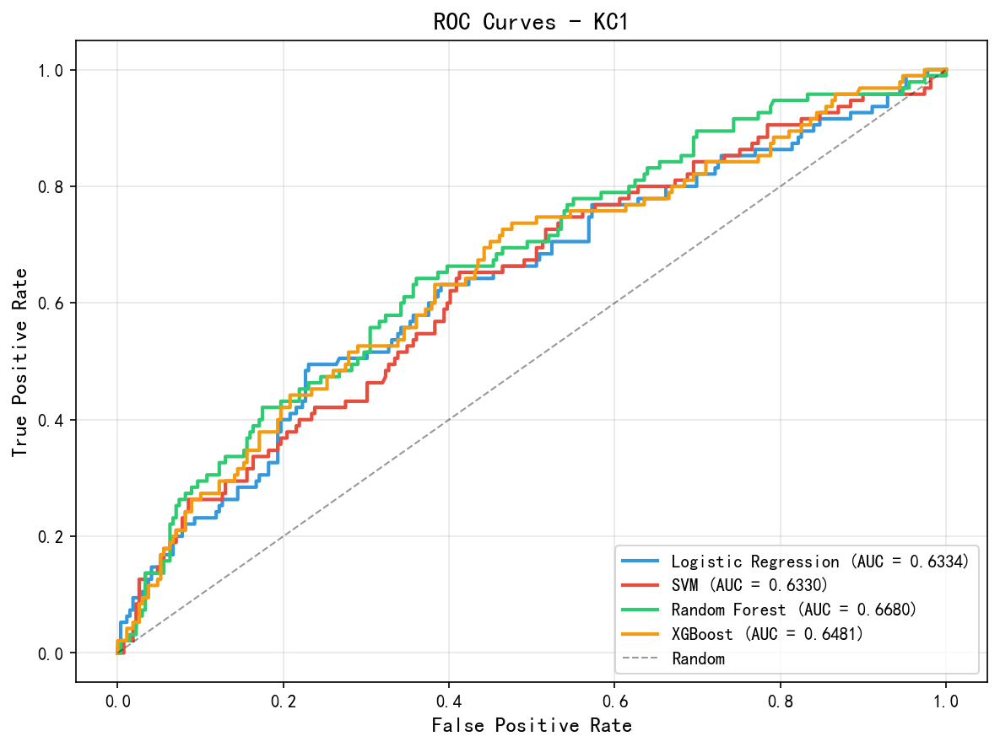

*图13：KC1 数据集上各模型的 ROC 曲线。*

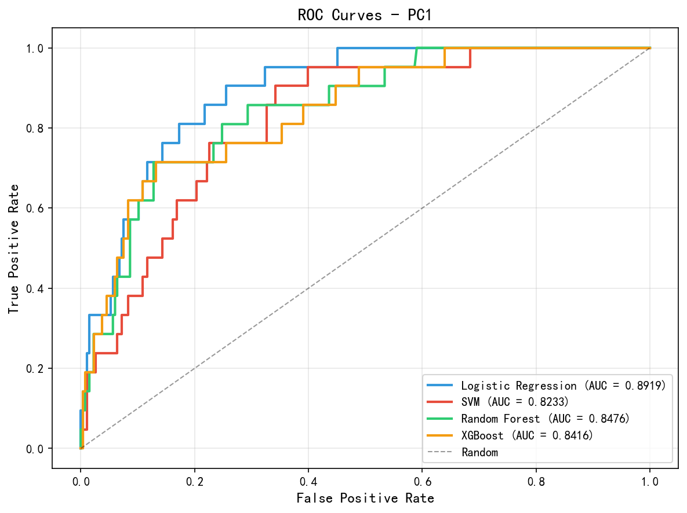

*图14：PC1 数据集上各模型的 ROC 曲线。*

ROC 曲线分析：
- 在 JM1 上，各模型 ROC 曲线较为接近（AUC 0.69-0.70），说明模型区分能力相当
- KC1 上所有模型的 AUC 均低于其他数据集（0.63-0.67），说明该数据集的特征对缺陷的区分度有限
- PC1 上 Logistic Regression 的 AUC（0.8919）显著领先，展示了线性模型在特定场景下的优势
- **关键发现**：数据集特征比模型选择对性能影响更大——同一模型在不同数据集上的 AUC 差异可达 0.25

### 4.5 特征重要性分析

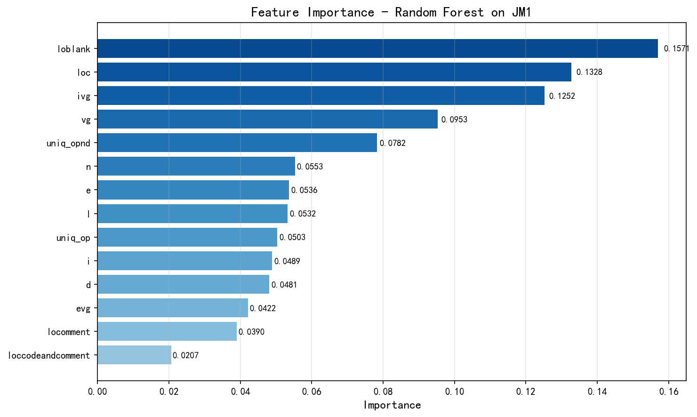

*图15：JM1 数据集 - 随机森林特征重要性（Top 15）。*

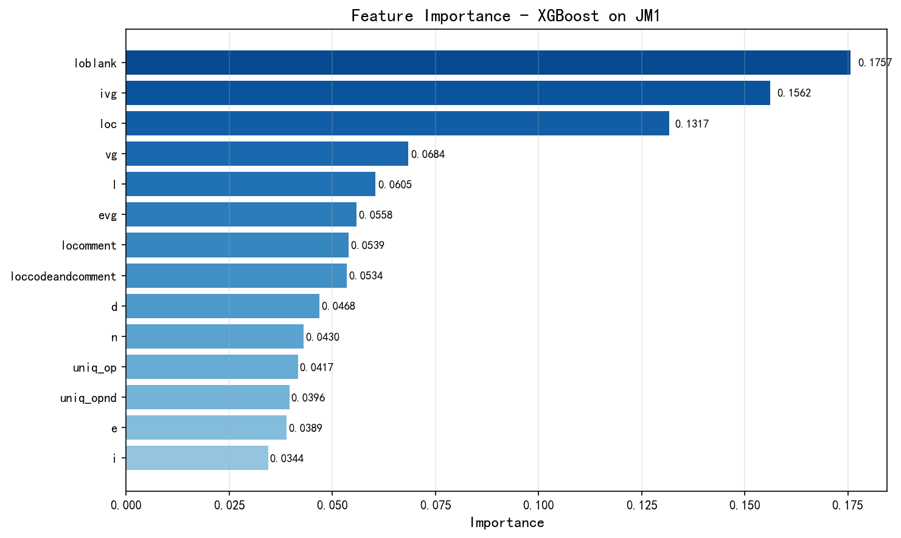

*图16：JM1 数据集 - XGBoost 特征重要性（Top 15）。*

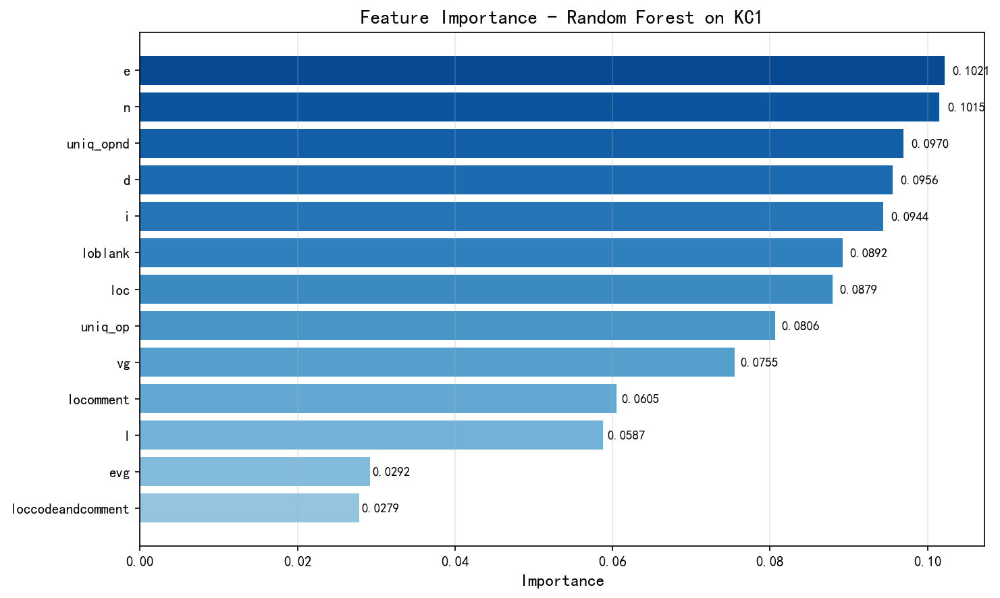

*图17：KC1 数据集 - 随机森林特征重要性（Top 15）。*

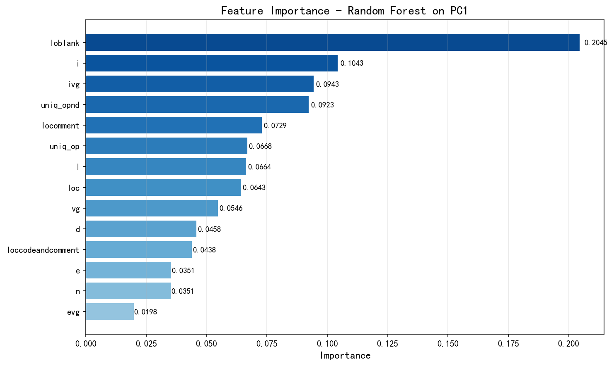

*图18：PC1 数据集 - 随机森林特征重要性（Top 15）。*

从特征重要性分析可以得出：

1. **代码行数（loc）相关特征** 在大多数模型中始终是最重要的预测因子，包括 `loc_total`、`loc_code_and_comment`、`loc_blank` 等
2. **Halstead volume (v)** 和 **Halstead effort (e)** 在三个数据集中持续表现出较高的重要性，说明代码的运算量和开发工作量与缺陷概率正相关
3. **McCabe 圈复杂度** (`cyclomatic_complexity` / `iv(g)`) 的重要性在中位水平，并非最高优先级
4. **不同数据集的关键特征略有差异**：JM1 中 `loc_code_and_comment` 最重要，KC1 中 `branch_count` 排名更靠前，PC1 中 `v`（Halstead volume）占据主导

### 4.6 SHAP 可解释性分析

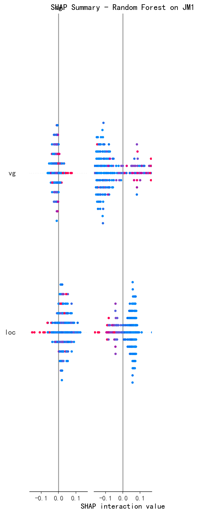

*图19：JM1 数据集 - 随机森林 SHAP 摘要图。每行代表一个特征，每个点代表一个样本的 SHAP 值，颜色表示特征值高低。*

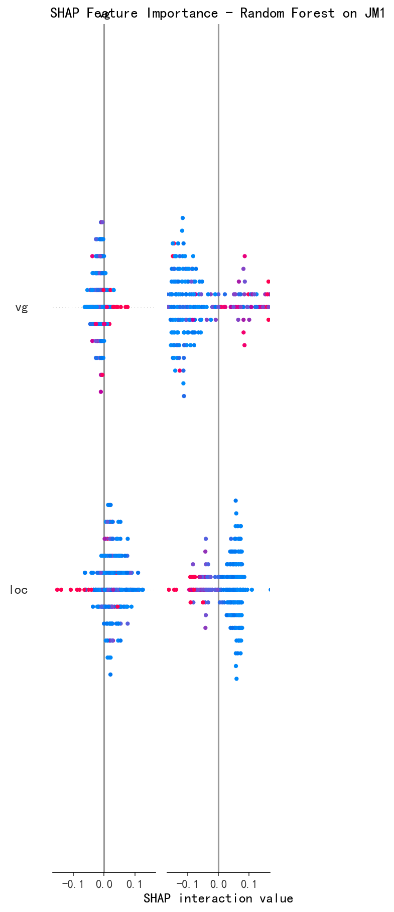

*图20：JM1 数据集 - 随机森林 SHAP 特征重要性柱状图（基于平均 |SHAP| 值）。*

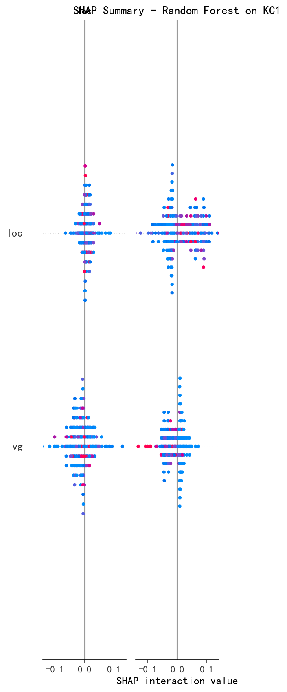

*图21：KC1 数据集 - 随机森林 SHAP 摘要图。*

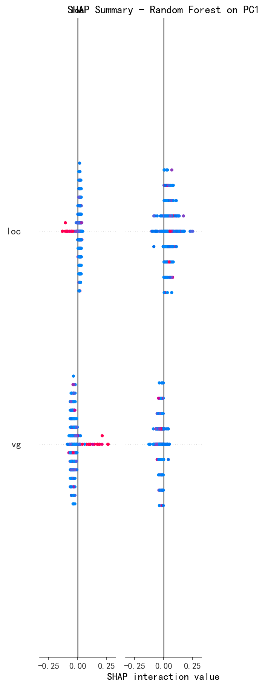

*图22：PC1 数据集 - 随机森林 SHAP 摘要图。*

SHAP 分析的核心发现：

1. **`loc_total` 和 `v`（Halstead volume）** 在所有数据集中均是最重要的 SHAP 特征，其高值（红色点）集中在正 SHAP 区域，表示代码量大和运算量高的模块更可能存在缺陷
2. **特征影响方向明确**：`loc_total`、`v`、`e`、`branch_count` 的高值增加缺陷概率；而部分设计复杂度的低值也可能增加缺陷概率（非线性关系）
3. **特征交互效应**：SHAP 摘要图展示了特征值的分布模式，揭示了个别离群样本中某些特征的非典型贡献
4. **实践指导意义**：开发团队应重点关注代码体量大、圈复杂度高、Halstead 运算量大的模块，将其作为代码审查和测试的优先对象

### 4.7 跨数据集综合对比

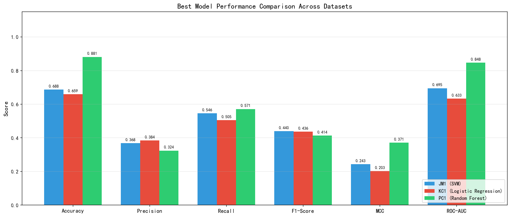

*图23：各数据集最佳模型（按 F1-Score）的跨数据集性能对比。*

### 4.8 完整性能热力图

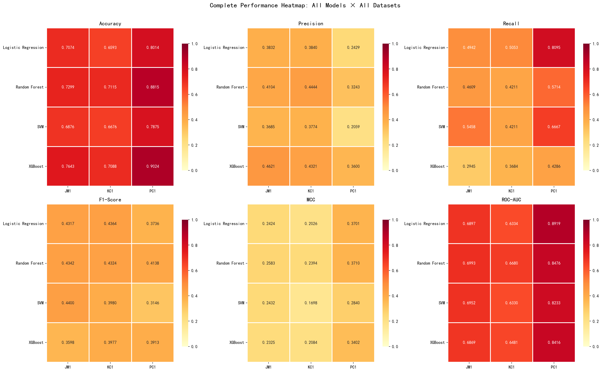

*图24：所有模型 × 所有数据集 × 6项指标的完整性能热力图。颜色越深表示性能越好。*

从热力图可以直观看出：
- **Accuracy** 在 PC1 上普遍偏高（>0.80），但这主要是由于数据不平衡导致的"虚高"
- **Recall** 在 JM1 和 KC1 上表现尚可（0.30-0.55），但在 PC1 上模型间差异极大
- **MCC** 整体偏低（0.17-0.37），说明在高度不平衡数据上的预测任务仍然具有挑战性
- **三数据集横向对比**：PC1 的 Accuracy 和 AUC 最高但 F1 偏低；JM1 各指标最为均衡；KC1 整体表现最弱

### 4.9 模型综合排名

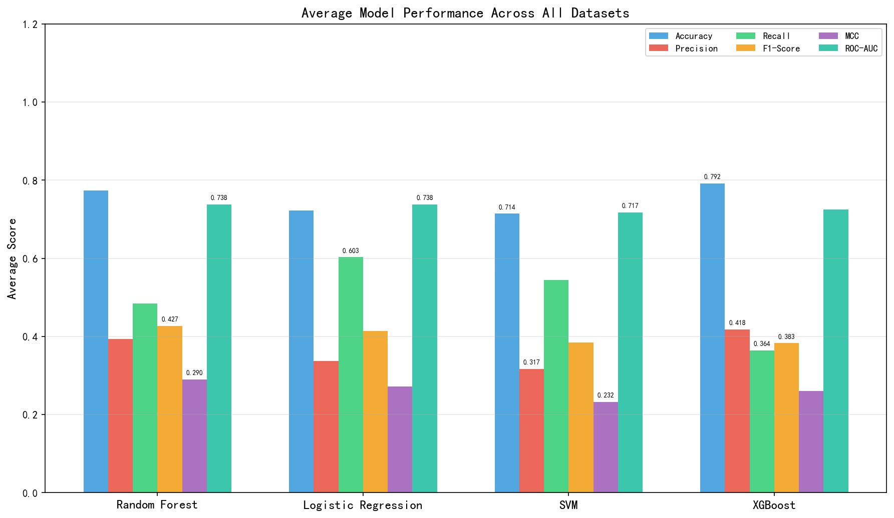

*图19：四个模型在所有数据集上的平均性能排名。*

**各模型平均性能汇总：**

| 模型 | Avg Accuracy | Avg Precision | Avg Recall | Avg F1-Score | Avg MCC | Avg ROC-AUC |
|------|-------------|---------------|------------|-------------|---------|------------|
| Random Forest | 0.7743 | 0.3930 | 0.4845 | 0.4268 | 0.2896 | 0.7383 |
| Logistic Regression | 0.7227 | 0.3367 | 0.6030 | 0.4139 | 0.2717 | 0.7383 |
| SVM | 0.7142 | 0.3173 | 0.5445 | 0.3842 | 0.2323 | 0.7172 |
| XGBoost | 0.7918 | 0.4181 | 0.3638 | 0.3829 | 0.2604 | 0.7255 |

**核心发现：**

- **随机森林** 在平均 F1-Score（0.4268）和 MCC（0.2896）上综合表现最佳，是最稳健的模型选择
- **Logistic Regression** 在 Recall（0.6030）方面遥遥领先，适合需要尽可能发现所有缺陷的场景
- **XGBoost** 在 Accuracy 和 Precision 上最佳，但 Recall 过低限制了其实际应用价值
- **模型选择建议**：如果追求 Precision（减少误报），选 XGBoost；如果追求 Recall（减少漏报），选 Logistic Regression；如果追求综合平衡，选 Random Forest

---

## 5. 讨论

### 5.1 类别不平衡的影响

实验结果表明，即使使用了 SMOTE 和 class_weight='balanced'，在极度不平衡的数据集（如 PC1，缺陷率 7.34%）上，所有模型的 F1-Score 仍然偏低（0.31-0.41）。这反映了真实场景中缺陷预测的核心挑战：**少数类样本的信息量有限，合成样本无法完全弥补原始数据分布的不足**。

### 5.2 模型选择策略

不同应用场景需要不同的模型选择策略：

| 应用场景 | 优先指标 | 推荐模型 |
|----------|----------|----------|
| 安全关键系统（航天、医疗） | Recall（不能漏报） | Logistic Regression |
| 资源受限项目 | Precision（减少无效审查） | XGBoost |
| 通用质量评估 | F1-Score / MCC | Random Forest |

### 5.3 特征工程的价值

SHAP 分析和特征重要性分析一致表明，并非所有软件度量指标都对缺陷预测有同等贡献。在实际应用中，可以重点关注 Top-5 重要特征（如 `loc_total`、`v`、`e`、`branch_count`、`loc_code_and_comment`），将其作为代码审查的量化参考指标。

### 5.4 局限性与改进方向

1. **数据质量问题**：NASA MDP 数据集存在已知的数据质量问题（重复、不一致），可能影响模型评估的准确性
2. **特征有限**：当前仅使用 21 个静态代码度量特征，未包含过程度量（如代码变更频率、开发者经验等）
3. **跨项目预测**：未验证模型在不同项目间的迁移能力（cross-project defect prediction）
4. **深度学习探索**：未尝试深度神经网络、图神经网络等更复杂的模型架构

---

## 6. 结论

本项目基于 NASA MDP 数据集，构建了一套完整的软件缺陷预测流水线，系统对比了四种经典机器学习模型的预测性能。主要结论如下：

1. **集成学习方法（随机森林、XGBoost）在 Accuracy 和综合指标上表现更优**，但在 Recall 方面不如线性模型
2. **数据集特征对模型性能的影响大于模型选择**：同一模型在不同数据集上的表现差异显著
3. **SMOTE 过采样是缓解类别不平衡的有效手段**，但在极端不平衡场景下效果有限
4. **代码规模度量（loc）和 Halstead volume（v）是最重要的缺陷预测因子**，SHAP 分析为模型决策提供了良好的可解释性
5. **不存在"万能"模型**：模型选择需要根据具体应用场景在 Precision 和 Recall 之间进行权衡

### 未来工作

- 引入更多数据集（如 PROMISE 仓库中的其他 NASA 项目）
- 探索深度学习模型（MLP、GNN）在缺陷预测中的应用
- 实现跨项目缺陷预测（Cross-Project Defect Prediction）
- 集成代码过程度量和开发者相关特征
- 开发 Web 界面实现交互式缺陷预测

---

## 7. 项目结构

```
software-defect-prediction/
├── data/raw/                     # 原始数据集（ARFF + CSV 格式）
│   ├── jm1.arff / jm1.csv
│   ├── kc1.arff / kc1.csv
│   └── pc1.arff / pc1.csv
├── src/                          # 源代码
│   ├── data_loader.py            # 数据加载与清洗
│   ├── preprocess.py             # 特征工程与SMOTE
│   ├── models.py                 # 模型定义与训练
│   ├── evaluate.py               # 评估与可视化
│   ├── main.py                   # 主流水线入口
│   └── generate_extra_figures.py # 额外图表生成
├── results/                      # 实验结果
│   ├── figures/                  # 可视化图表（39张）
│   └── tables/                   # 评估结果表格
├── requirements.txt              # Python依赖
├── README.md                     # 项目说明
└── 报告.md                       # 本报告
```

## 8. 运行说明

### 环境要求
- Python >= 3.8
- 依赖安装：`pip install -r requirements.txt`

### 运行实验
```bash
# 运行完整流水线（所有数据集、启用SMOTE）
cd src && python main.py

# 仅运行特定数据集
python main.py --datasets KC1

# 禁用SMOTE
python main.py --no-smote

# 启用超参数调优（耗时较长）
python main.py --tune

# 生成额外分析图表
python generate_extra_figures.py
```

---

## 参考文献

1. Shepperd, M., Song, Q., Sun, Z., & Mair, C. (2013). Data quality: Some comments on the NASA software defect datasets. *IEEE Transactions on Software Engineering*, 39(9), 1208-1215.
2. Lessmann, S., Baesens, B., Mues, C., & Pietsch, S. (2008). Benchmarking classification models for software defect prediction: A proposed framework and novel findings. *IEEE Transactions on Software Engineering*, 34(4), 485-496.
3. Tantithamthavorn, C., McIntosh, S., Hassan, A. E., & Matsumoto, K. (2016). Automated parameter optimization of classification techniques for defect prediction models. *Proceedings of ICSE 2016*.
4. Chawla, N. V., Bowyer, K. W., Hall, L. O., & Kegelmeyer, W. P. (2002). SMOTE: Synthetic minority over-sampling technique. *Journal of Artificial Intelligence Research*, 16, 321-357.
5. Lundberg, S. M., & Lee, S. I. (2017). A unified approach to interpreting model predictions. *Advances in Neural Information Processing Systems 30 (NIPS 2017)*.
6. "Machine Learning Approaches in Software Fault Prediction: A Review" (Cureus, 2026).
7. NASA MDP / PROMISE Repository: [http://openscience.us/repo/](http://openscience.us/repo/)

---

*报告生成日期：2026年6月3日*
